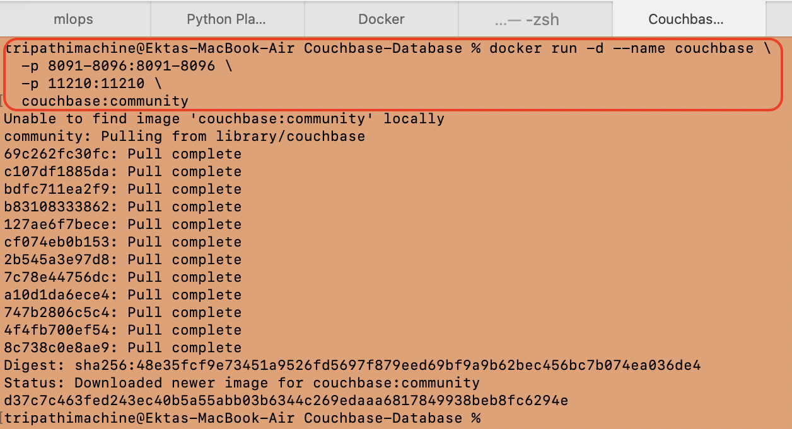
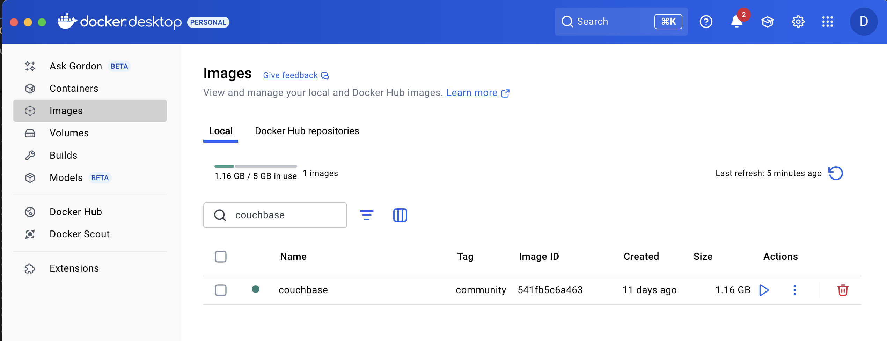
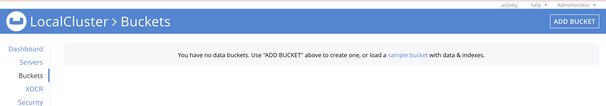
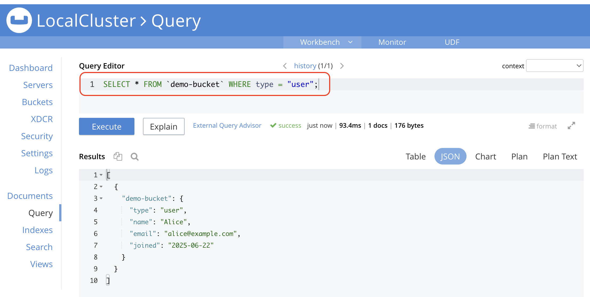

# 🎯 Goal:
Get Couchbase running locally using Docker, access the Web UI, create a bucket, and add your first document.

# Couchbase in a Docker
## 🛠️ Step 1: Install Couchbase Using Docker
Make sure Docker Desktop is running.

## 🔧 Run this command:
```bash
docker run -d --name couchbase \
  -p 8091-8096:8091-8096 \
  -p 11210:11210 \
  couchbase:community
```




## 🖥️ Access the Couchbase Web Console:
Open your browser and visit:

👉 http://localhost:8091

## 🛠️ Step 2: Initial Web UI Setup
Once the UI loads:

1. Create a New Cluster

   * Name: LocalCluster

   * Username: Administrator

   * Password: password (for local learning only)

2. Accept Term and Conditions and proceed with "Default".
   
3. Skip Email & Analytics Setup (for now)

4. Create a Bucket
    
   * Name: demo-bucket

   * Quota: Leave default (e.g., 100 MB)

   * Type: Couchbase

   * Enable Flush (optional)

## 🛠️ Step 3: Add a Document via Web UI
1. Go to Buckets → demo-bucket

2. Click Documents

3. Click Add Document

4. Paste this JSON:
```json
{
  "type": "user",
  "name": "Alice",
  "email": "alice@example.com",
  "joined": "2025-06-22"
}
```

5. Click Save

## 🧪 Step 4: Try a N1QL Query
Go to the Query tab and try:
```sql
SELECT * FROM `demo-bucket` WHERE type = "user";
```
⚠️ If you get an error, you might need to create a primary index first:
```sql
CREATE PRIMARY INDEX ON `demo-bucket`;
```
Then rerun the query above.



