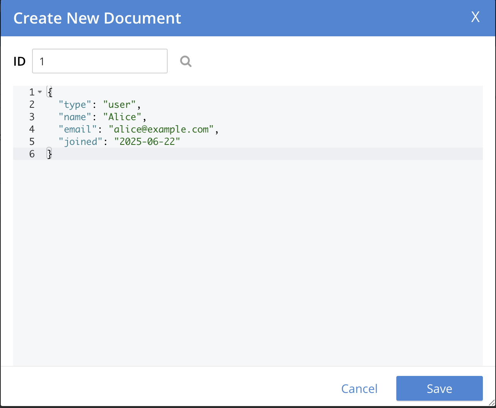

# 🎯 Goal:
Get Couchbase running locally using Docker, access the Web UI, create a bucket, and add your first document.

# Couchbase in a Docker
## 🛠️ Step 1: Install Couchbase Using Docker
Make sure Docker Desktop is running.

## 🔧 Run this command:
```bash
docker run -d --name couchbase \
  -p 8091-8096:8091-8096 \
  -p 11210:11210 \
  couchbase:community
```


## 🖥️ Access the Couchbase Web Console:
Open your browser and visit:

👉 http://localhost:8091

## 🛠️ Step 2: Initial Web UI Setup
Once the UI loads:

1. Create a New Cluster

   * Name: LocalCluster

   * Username: Administrator

   * Password: password (for local learning only)

2. Accept Term and Conditions and proceed with "Default".
   
3. Skip Email & Analytics Setup (for now)

4. Create a Bucket
    
   * Name: demo-bucket

   * Quota: Leave default (e.g., 100 MB)

   * Type: Couchbase

   * Enable Flush (optional)

## 🛠️ Step 3: Add a Document via Web UI
1. Go to Buckets → demo-bucket

2. Click Documents

3. Click Add Document

4. Paste this JSON:
```json
{
  "type": "user",
  "name": "Alice",
  "email": "alice@example.com",
  "joined": "2025-06-22"
}
```

5. Click Save

## 🧪 Step 4: Try a N1QL Query
Go to the Query tab and try:
```sql
SELECT * FROM `demo-bucket` WHERE type = "user";
```
⚠️ If you get an error, you might need to create a primary index first:
```sql
CREATE PRIMARY INDEX ON `demo-bucket`;
```
Then rerun the query above.


## 🛑 To Stop the Couchbase Container:
Once you're done using Couchbase, it's safe and recommended to stop the container — otherwise, it will keep consuming memory and CPU in the background.

```bash
docker stop couchbase
```
✅ This pauses the container but doesn't delete it. You can restart it later.

▶️ To Start It Again Later:
```bash
docker start couchbase
```

❌ To Remove the Container Completely (only if needed):
```bash
docker rm -f couchbase
```
But be careful: this deletes all data and config unless you mounted volumes (which we haven't done yet).

Optionally, we could persist data using Docker Volumes, and also could have Bash Script to start / stop Couchbase easily.

