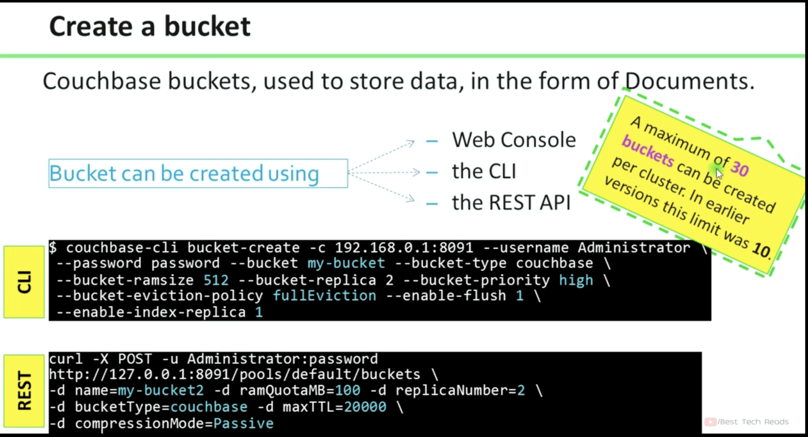
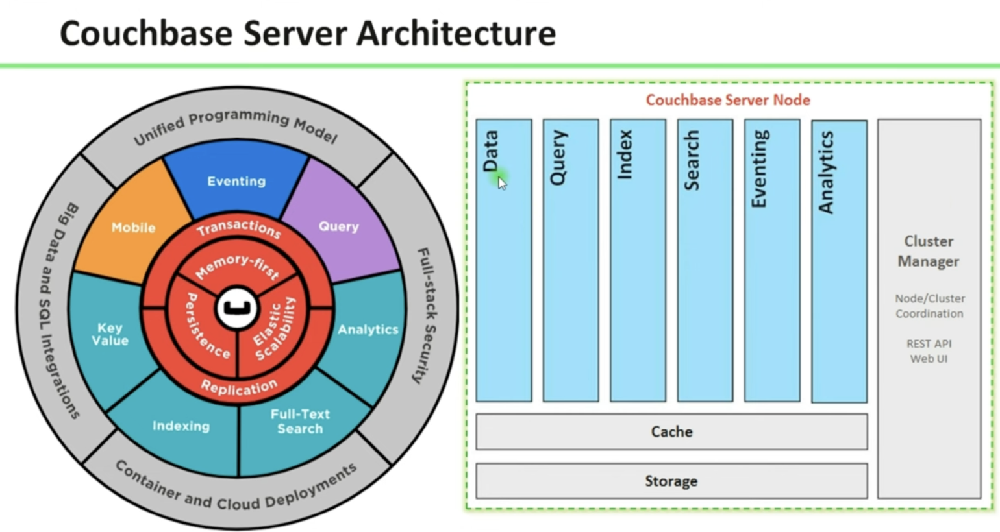
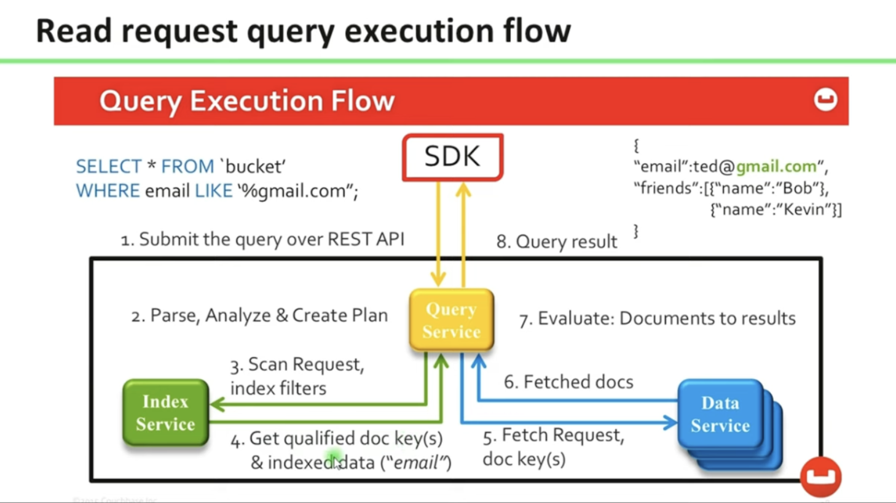
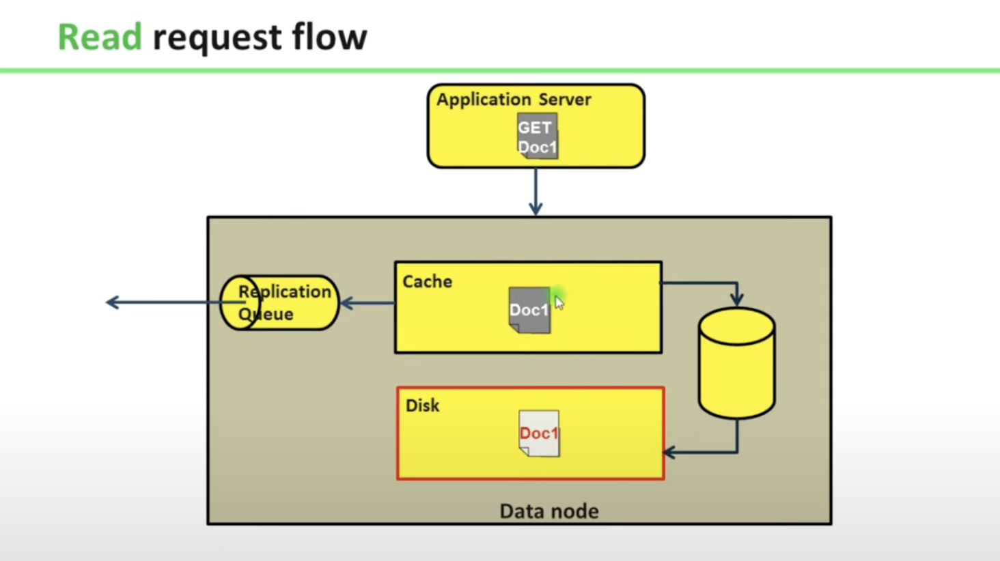
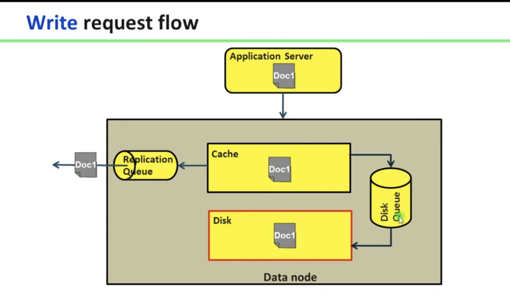
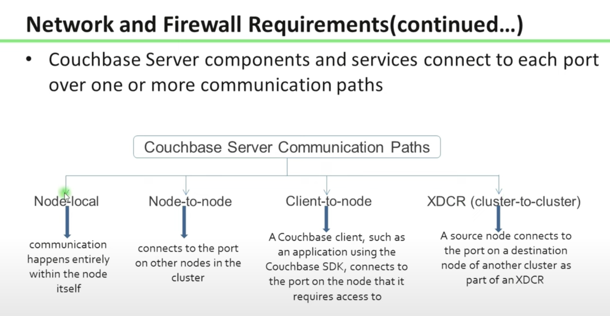
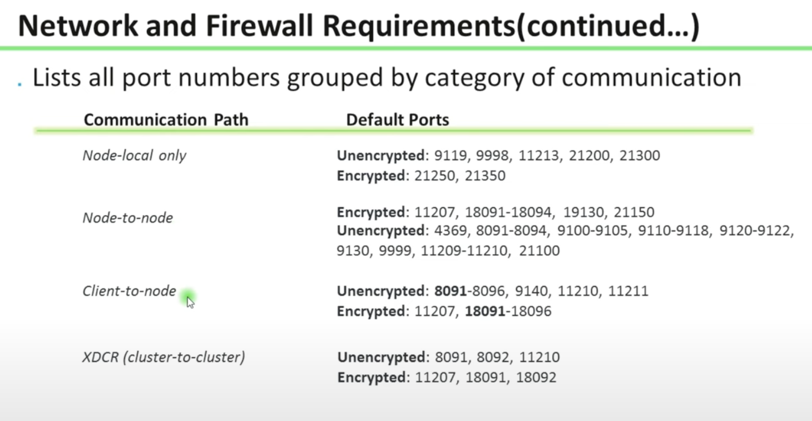

# Notes from Youtube Channels and Other resources.

# Basics
Couchbase is NoSQL Database.
It supports
- Semi-Structure data such as
  - JSON data
  - Binary Data
- Works on Key-Value paris concept.
  - Key is 
  - Value could be the entire JSON Document or single value.

**Features / Benefits of Couchbase**
1. [Memory First Architecture](/Couchbase-Database/docs/01_overview.md#1--memory-first-architecture).
    Couchbase database follow memory (RAM) first architecure, which means for any write operation data first goes to RAM / Memory and then replicates to Disk. 
2. Distributed Database

3. Scalability
    Easily scale Horizontally by adding more nodes.

4. Fault-Tolerance

**Data**
- JSON Document
- Key-Value
- Flexible schema
- Dynamic add or remove schema
- N1QL for query (run sql like query to fetch data)

**Bucket**
- Consider kind of Database when compared to Relational Database.
- Limit to 10 Buckets in complete couchbase server / cluster.
- Documents that contains data as key value paris will be stored in a Bucket.
- Bucket is logical structure on the cluster.
- Each bucket has 1024 vBuckets (Shards)
- Data spread evenly acorss the cluster (with rebalance).
- Each key is mapped to a vBucket on a node.
- Types of Bucket: [Refer](/Couchbase-Database/docs/01_overview.md#types-of-bucket).
- Create a Bucket

- 

**VBuckets**
- For each bucket, there will be 1024 virtual buckets as a default. Internally created by Couchbase.
- These VBuckets are distributed in each clusters. 

**Compression**
- Option to enable compression in Memory.
- Save the data in compressed format in RAM to reduce the data size.
- Disk will always saves in compressed format.

**Expiration**
- Time to Live (TTL) determines how long the data to retain and then expire or delete.
- How Couchbase keeps trac and deletes or flags any Document as Soft-Delete? Vs when it will get deletes physically?
- Are we able to access a Document once the TTL is reached?
- 2 ways to define expiration time 
  - Bucket level
  - Document level
- What is Pager Expiry? => 

**Memory and Storage**
- Documents get stored into RAM first, and then there are ASYNC process to replicate the same data into Disk.
- In case of GET or reterival process, first it will check in RAM, and if not available then it will fetch from Disk and stores in RAM and then respond to users request.
- In RAM we have option to store data in Compressed format or non-compressed format, however in Disk it will always be in Compressed format.
- When read from Disk to RAM, it will first compressed if RAM has compression enabled.

**Indexing**
- Primary Index: Mosly on Key
- Secondary Index: Indexing on other element other than Key.
- Composite Secondary Index
- Array Index
- Full Text Index

**Views**
- Similar concepts of View as in Relational Database.
-  

**Couchbase Architecture**
- Runs on a Cluster
- There will be multiple Nodes in a Cluster.
- Each node runs independently within the Cluster.
- Each nodes has same or different serviecs running in it. Have option to choose to what all services should run in a gievn Node.
- Services
  - Data Service => Responsible to Data Storage in RAM and (or) Disk. Ops are served from cache first, Disk seek only on a cache miss. Cache miss docs are cached.
  - Index Service => Responsible for Indexing. Creates indexes, for use by the Query and Analytics Services.
  - Query Service => Responsible to querying on Couchbase. For SQL Support. Parses queries specificed in the N1QL query-language, executes the queries, and returns results. The Query service interacts with both the Data and Index Services.
  - Search Service => Create indexes specially purposed for Full Text Search. This supports language-aware searching; say, the word beauties, and additionally obtain results for beauty and beautiful.
  - Analytic Service => Complex Queries. Supports join, set, aggregation, and grouping operations; which are expected to be large, long-running, and highly consumptive of memory and CPU resources.
  - Eventing => Supports near real-time handling of changes to data: code can be executed both in response to document-mutations, and as scheduled by timers.
- These services can be deployed, maintained, and provisioned independently of one another, by means of Multi-Dimensional Scaling.


**Limitations**
- Supports only Key - Value pair
- Key size is max of 250 bytes.
- Value size is max of 20 MB.
- Could have max of 10 Buckets in your Couchbase Cluster.
- In Prod, recommended to have min of 3 nodes. 
- 


**Scenario**
1. what happens when the RAM / Memory is full and a new document arrives?
    As we learned that Couchbase is Memory-First, any incoming data will first goes into memory and staty there. 
    Now we already added "n" documents and the "n" is so huge that our RAM is all full across all nodes in your cluster. So what will happen when a new document (K n+1 & V n+1) arrives.
    One of the document will get ejected from the RAM and is written / asaved into the Disk. With this a space is created for "n+1"th document.

    How this document is selected -- The less frequent used document. 

2. Once the data is written into RAM, and before it gets replicated to Disk, there was power issue or some other issue. How to ensure we have consistent data.?
3. 


# Database Administration (DBA) and Concepts

**CAP Theorem**
- CAP => Consistency Availability Partition Tolerance.
- Consistency - Can all nodes see same data, at all times?
- Availability - Can all nodes be read from and written to, at all times?
- Partition Tolerance - Will nodes function normally, even when the cluster breaks?
- Choose any two and minimize costs for third one.
- CP (Consistency & Partition Tolerance)
  - Immediately consistent data across a horizontal scaled, even with network problems.
  - Couchbase due to key resolving data to single node.
- AP (Availability & Partition Tolerance)
  - Always services requests, acorss multiple data centers, even with network problems, data will be eventually consistent.
  - Apache HBase or Cassandra, COuchbase XDCR synchronized between clusters.
- CA (Consistency & Availability)
  - Services requests with immediately consistent data, in a vertically scaled system
  - MySQL, Oracle, Miscrosft SQL Server.


**Which persistence technologies are appropriate**
You need to ask how you want to manipulate the data this will help us figure out which persistence technologies are appropriate.
- User Sessions: Couchbase Ephemeral / Redis
- Financial Data: RDBMS
- Shopping Cart: Couchbase Ephemeral / Riak
- Recommendation Systems: Neo4j
- Product Catalog (PRoduct Features): Couchbase / MongoDB
- Reporting: RDBMS
- Analytics: Couchbase Analytics / Cassandra

**Major Types of NoSQL**
With the 2.0 release Couchbase is both a Key-Value and a Document database.
- Key-Value Store: Couchbase, MongoDB, Redis, Memcached.
- Document Store: DynamoDB, Couchbase, MongoDB
- Wide Column Store: Cassandra, ScyllaDB
- Graph: Neo4j

**Architecture**
 

**Couchbase Document**
- A document refers to an entry in the database (Other databases may refer to the same concept as a row).
- Document Content: Stores data as key value paris. Most recent documents stay in RAM and persisted to disk.
```json
{
    "callsign": "MILE-AIR",
    "country": "United States",
    "iata": "QS",
    "icao": "MLA",
    "id": 10,
    "name": "40-Mile Air",
    "type": "airline"
}
```
- Document Metadata: All keys unique and kept in RAM. This data will be used for expiration, conflict resolution etc.
```json
{
    "meta": {
        "id": "airline_10",
        "rev": "1237d720ecba170003sf334",
        "expiration": 0,
        "flags": 33554532,
        "type": "json"
    },
    "xattrs": {}
}
```

**Types of Bucket**
- Couchbase Bucket => Works in memory & disk, asynchronous persistence to disk. 20 MB per item value limit.
- Memcached Bucket => In-memory only (for backward compatibility). 1 MB limit.
- Ephemeral Bucket => Alternative to Couchbase buckets, to be used whenever persistence is not required. 20 MB per item value limit.
  

**Read Request Query Execution Flow**


**Read Request Flow**


**Write Request Flow**


Network and Firewall Requirements & Ports




# Commands
**Create a Bucket**
Bucket can be created using 
    - Web Console
    - CLI
```bash
couchbase-cli bucket-create -c 192.168.0.1:8091 \
--username Administrator \
--password password \
--bucket my-bucket \
--bucket-type couchbase \
--bucket-ramsize 512 \
--bucket-replica 2 \
--bucket-priority high \
--bucket-eviction-policy fullEviction \
--enable-flush 1 \
--enable-index-replica 1
```
    - REST API
```bash
curl -X POST -u Administrator:password \
http://127.0.0.1:8901/pools/default/buckets \
-d name=my-bucket2 -d ramQuotaMB=100 -d replicaNumber=2 \
-d bucketType=couchbase -d maxTTL=20000 \
-d compressionMode=Passive
```

**Loading Dummy Data**
The `cbworkloadgen` tool is useful to test a COuchbase cluster as well as to generate dummy data sets.
```bash
cbworkloadgen -n 192.168.0.1:8901 -b my-bucket -u Administrator -p password \
-i 1000000 -j -r 1 -s 10240
```
Generate a dataset of one million JSON documents on a CLuster, with bodies of atleast 10240 bytes (10Kb).

`cbc-pillowfight`  creates a specificed number of threads each
```bash
cbc-pillowfight 20 -B 1
```
Run with 20 threads / instances, each doing one operation at a time.

```bash
cbc-pillowfight -M $(1024*1024) -m $(1024*1024) -c 100 -I 50
cbc-pillowfight -u Administrator -p couchbase -M 1024 -c 10000 -I 50 -b bucketName
```
Run 100 iterations of 2 MB iteam sizes, using a dataset of 50 items.

**Export**
`cbexport` Export data from Couchbase in various different formats.
|Flag|Description|
|--|--|
|-c|CLuster Address|
|-u / -p|Usernane and Password with permissiosn for target Bucket|
|-b|Name os precreated target bucket|
|-f|The format of the dataset specificed (lines or list)|
|-o|The path to the location of the file|

The lines format specified a file that contains one JSON document on every line in the file.

The list format specifics a file which contains a JSON list where each element in the list of a JSON document.

